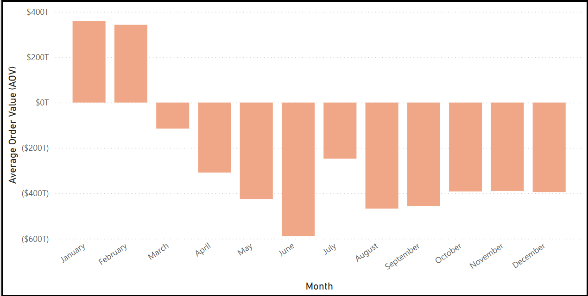
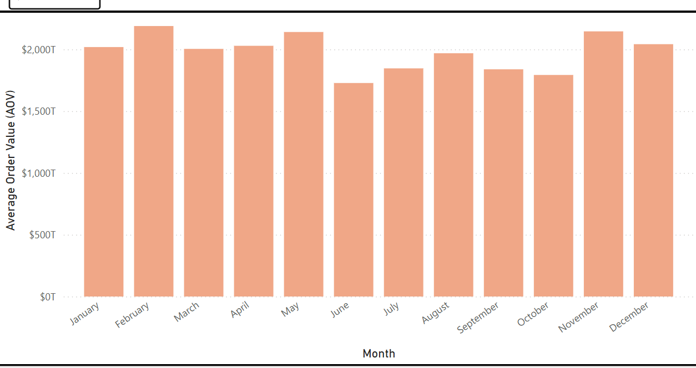
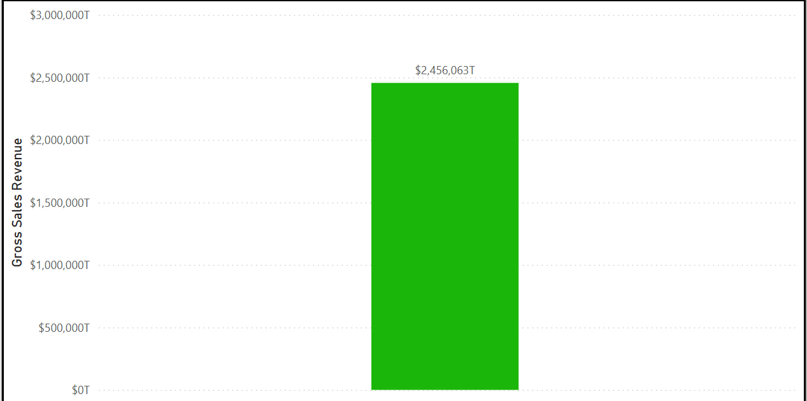

# Retail-Analytic-Dashboard
An interactive retail analytics project analyzing store performance, transaction trends, inventory optimization, and customer purchasing patterns.

# Retail Operations & Sales Analytics Dashboard

A comprehensive data analysis and business intelligence project designed to monitor retail performance metrics, optimize inventory levels, and evaluate store-level profitability.

## Business Impact & Insights
- **Sales Performance:** Tracked revenue growth, transaction counts, and average basket value across multiple store locations.
- **Inventory & Stock Management:** Identified slow-moving product categories and high-demand items to minimize stockouts and improve turnover rates.
- **Operational Efficiency:** Analyzed peak shopping hours and seasonal sales trends to assist managers with staffing and promotional planning.

## 🛠 Tools Used
- **SQL / Python:** For data extraction, handling anomalies, and structural cleaning.
- **Power BI:** For building an intuitive star-schema data model, writing DAX measures, and designing interactive executive layouts.

## Dashboard Previews
### Report 1: Regional & Mall-Specific Sales Performance
Comprehensive overview tracking individual mall operations, category breakdown, and transaction trends.

### Report 2: Global Retail Dashboard Overview
Full operational health canvas displaying overall transactional volumes, gross sales revenue, and cross-filtered analytics.

### Report 3: Monthly Average Order Value (AOV) Deficit Analysis
breakdown tracking seasonal order fluctuations and identifying strategic transaction variance by month.

### Report 4: Monthly Trend Analysis (Stable Target Benchmark)
Macro view tracking positive Average Order Value performance consistency and seasonality patterns across the fiscal calendar.

### Report 5: Isolated Gross Sales Revenue Metrics
Strategic single-variable performance tracking focused purely on total gross sales metrics and baseline revenue contribution.

## Project Structure
- `retail_data_clean.csv`: Processed retail transaction records.
- `Retail_Analysis.pbix`: Dynamic Power BI report file with cross-filtering and active metrics.
- `README.md`: Project documentation.

## Key Metrics Tracked
1. **Sales & Gross Margin:** Tracking baseline profitability across departments.
2. **Basket Analysis:** Understanding the average number of items per transaction and total spend.
3. **Regional Performance:** Comparing store KPIs to target benchmarks.
